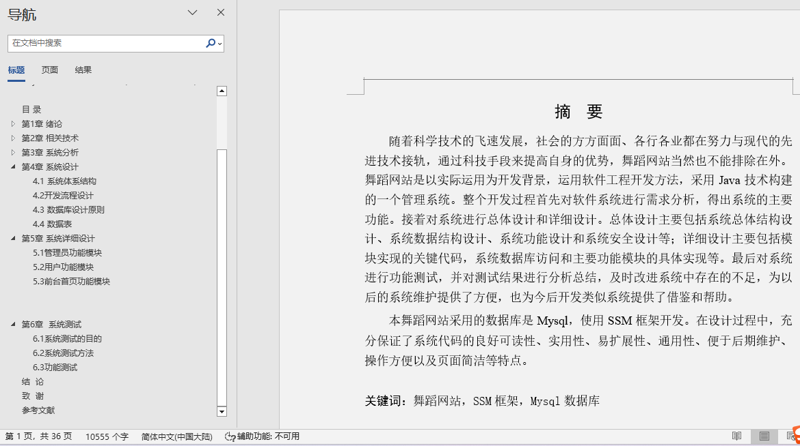
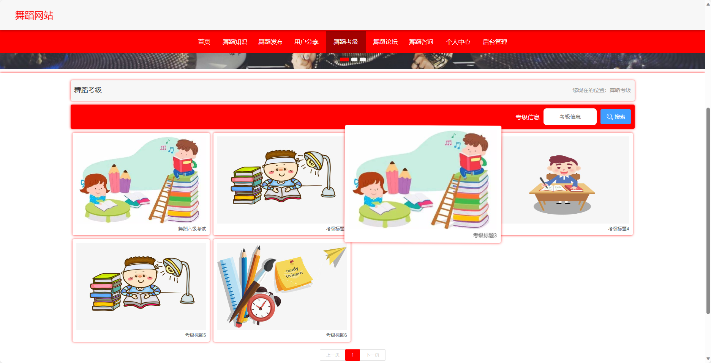
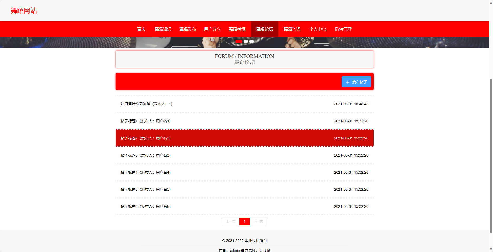
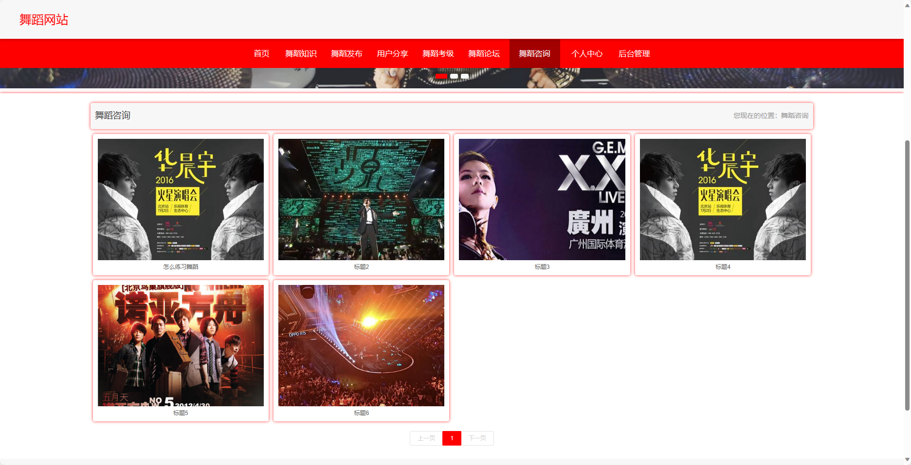
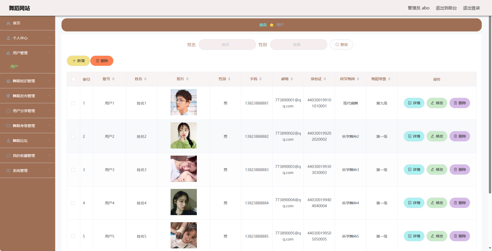
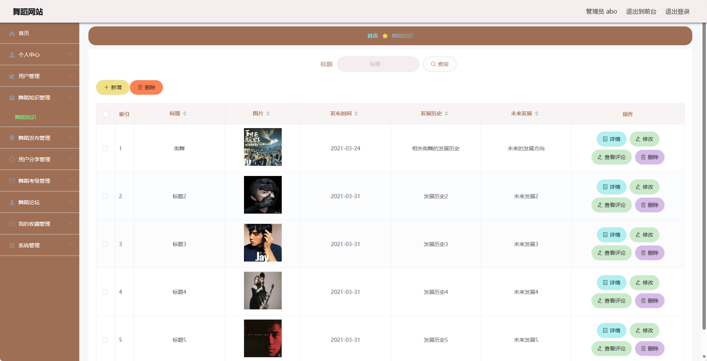

## 基于SSM框架实现的舞蹈网站(程序+报告)

###  获取sql数据库文件: 从戎源码网 (https://armycodes.com/) QQ: 386869957 QQ群: 377586148
###  所有系统地址: (https://github.com/YuLin-Coder/AllProjectCatalog) 
###  所有项目以及源代码本人均调试运行无问题 可支持远程安装部署调试、定制修改、代码讲解

## 项目介绍
基于SSM框架实现的舞蹈网站，系统包含两种角色：管理员、用户,系统分为前台和后台两大模块，主要功能如下。
前台-【用户】：
1. 首页：展示舞蹈网站的基本信息和推荐舞蹈作品，提供快捷入口和搜索功能，方便用户浏览和查找感兴趣的舞蹈内容。
2. 舞蹈知识：提供舞蹈知识的分享和学习，包括舞蹈技巧、舞蹈历史、舞蹈理论等，帮助用户提升舞蹈水平和了解舞蹈文化。
3. 舞蹈发布：用户可以上传自己的舞蹈作品，分享给其他用户，并提供作品的详细信息和视频展示，让用户展示自己的舞蹈才华。
4. 用户分享：用户可以发布舞蹈相关的动态、心得体会、舞蹈心情等内容，与其他用户进行交流和分享，增加用户之间的互动和社交。
5. 舞蹈考级：提供舞蹈考级的信息和指导，包括考级要求、报名流程、考试内容等，帮助用户规划舞蹈学习和提升舞蹈水平。
6. 舞蹈论坛：提供舞蹈爱好者的交流平台，用户可以在论坛中发帖、评论、回复，与其他用户讨论舞蹈话题，分享经验和知识。
7. 舞蹈咨询：提供舞蹈学校、舞蹈培训机构、舞蹈演出等相关信息和咨询服务，帮助用户获取舞蹈相关的资讯和资源。
8. 个人中心：用户可以注册账号并登录，查看个人信息和舞蹈记录，管理收藏、评论等操作，方便用户个人信息和舞蹈记录的管理和查看。

后台-【管理员】：
1. 个人中心：管理员可以登录系统后台，查看个人信息和管理账号相关设置。
2. 用户管理：管理员可以管理用户信息，包括查看用户列表、编辑用户信息、冻结用户账号等操作，维护用户数据的完整性和安全性。
3. 舞蹈知识管理：管理员可以管理舞蹈知识的发布和编辑，包括添加、修改和删除舞蹈知识内容，确保舞蹈知识的质量和准确性。
4. 舞蹈发布管理：管理员可以管理舞蹈作品的发布和编辑，包括添加、修改和删除舞蹈作品信息，审核用户上传的舞蹈作品，维护作品的质量和版权。
5. 用户分享管理：管理员可以管理用户分享的内容，包括审核用户发布的舞蹈心得、动态、舞蹈心情等，确保内容的合规性和质量。
6. 舞蹈考级管理：管理员可以管理舞蹈考级相关的信息，包括添加、修改和删除考级内容，维护考级信息的准确性和及时性。
7. 舞蹈论坛：管理员可以管理舞蹈论坛的帖子和评论，包括审核、删除和置顶帖子，维护论坛的秩序和内容质量。
8. 我的收藏管理：管理员可以管理用户的收藏记录，包括查看用户的收藏列表、删除用户的收藏内容等，帮助用户进行收藏的管理和维护。
9. 系统管理：管理员可以管理系统的设置和配置，包括网站基本信息的修改、轮播图的管理等，确保系统的正常运行和用户体验。
10. 舞蹈咨询：管理员可以管理舞蹈咨询的信息和服务，包括添加、修改和删除舞蹈咨询内容，提供准确和及时的咨询服务。

## 项目技术
- 编程语言：Java
- 数据库：MySQL
- 前端技术：vue、html、js
- 后端技术：Spring、SpringMVC、MyBatis

## 运行环境
- JDK版本：JDK1.8及以上
- 开发工具：IDEA、Ecplise、Myecplise都可以
- 数据库: MySQL5.7及以上

## 运行截图

